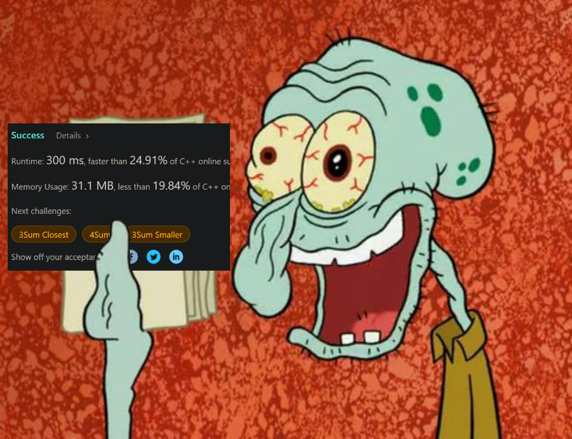

# Aoba

### para iniciar

- Fazer um fork do repo
- Criar uma branch no padrão `[username]-teste` para commitar nela
- Não usar IA :)

### Ao finalizar

- Criar pull-request (PR) na branch tua branch para a main do projeto e gerar a contrib no github
obs: no corpo do PR, explicar como pensou na solução

### :)

Cuida